## Proyecto de Clase: Sistema de Bienes Raices
---

En esta proyecto se pondra en ejemplo practico la creacion de APIs propias asi como
el consumo de APis de terceros (Gestion de Mapas, Envio de Correos, Autentificacion
por redes sociales, gestion de Basesd de Datos, Gestion de Archivos, Seguridad,
Control de Sesiones y validaciones. En el contexto real de la compra, venta o renta
de propiedades).

---

Esta practica se desarrollara con estructuras ramales, por cada fase, para el estudiante continue practicando la manipulacion correcta de ramas en el contexto de versiones y desarrollo colaborativo utilizando Git y Github.

---

### Consideraciones:

El proyecto estara basado en una Arquuitectura SOA(Service Oriented Architecture), el
Patron de Diseño MVC(Model, View, Controler) y servicios API REST, debera
gestionarse debidamente en el uso del control de versiones y ramas progresivas del
desarrollo del mismo 

### Tabla de Fases

|No.|Descripcion|Ponteciador|Estatus|
|---|---|---|---|
| 1.|Configuración inicial del Proyecto (NodeJS)|2|✅ Terminado|
| 2.|Routing y Requests (peticiones)|5|✅ Terminado|
| 3.|Layout, Templates Engines y Tailwind CSS (Frontend)|5|✅ Terminado|
| 4.|Creacion de Paginas de Login y Creacion de Usuarios|6|✅ Terminado|
| 5.|ORMs y Bases de Datos|7|✅ Terminado|
| 6.|Insertando Resgistros en la Tabla Usuarios|20|✅ Terminado|
| 7.|Implementacion de la Funcionalidad (Feature) Recuperacion de Contraseñas (Password Recovery)|20|✅ Terminado|
| 8.|Autentificacion de Usuarios (auth)|❌|❌|
| 9.|Definicion de Clase Propiedades (property)|❌|❌|
| 10.|Operaciones CRUD (Create, Read,Update, Delete)|❌|❌|
| 11.|Proteccion de Rutas y Validaciones de Tokens de Sesion (JWT)|❌|❌|
| 12.|Añadir imagenes e la propiedad (Gestion de Archivos)|❌|❌|
| 13.|Elaboracion Panel de Administracion (Dashboard)|❌|❌|
| 14.|Formulario de Edicion de Propiedades|❌|❌|
| 15.|Formulario de Eliminacion de Propiedades|❌|❌|
| 16.|Pagina de Consulta Propiedades|❌|❌|
| 17.|Implementacion del paginador|❌|❌|
| 18.|Creacion  de la Pagina Inicial (index)|❌|❌|
| 19.|Creacion de la Paginas Categorias y Paginas Error(404)|❌|❌|
| 20.|Envio de Email por un formulario de Contacto|❌|❌|
| 21.|Cambiar el Estatus de una Propiedad|❌|❌|
| 22.|Barras de Navegacion y Cierre de Sesion|❌|❌|
| 23.|Publicacion del API y el Frontend|❌|❌|

---

## Resultados Obtenidos

# Test 1: Interacción Rotativa (Registro, Login y Recuperación)

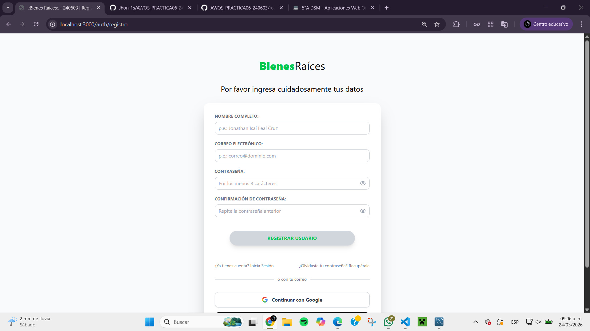
*Navegación y enlace a Login*
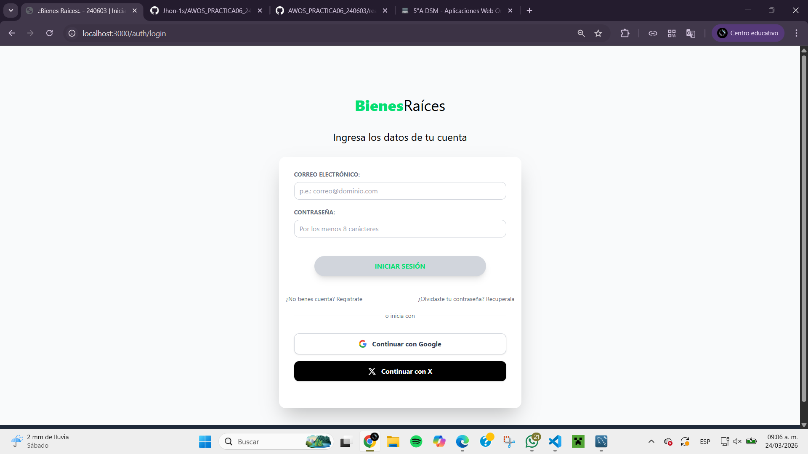
*Navegación y enlace a Recuperación*
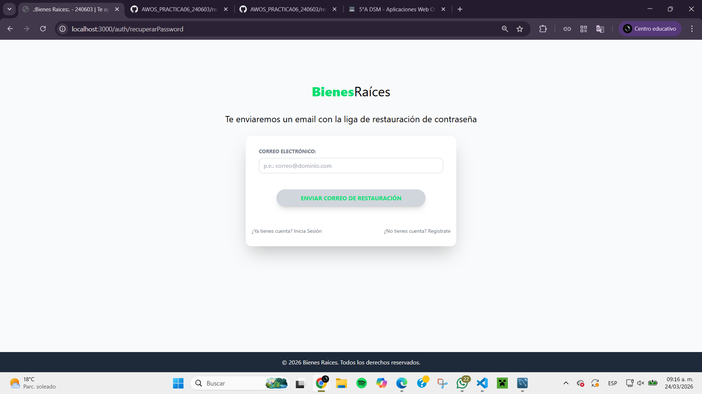
*Navegación y enlace entre las diferentes vistas públicas de autenticación sin errores de ruteo.*

---

# Test 2: Registro Exitoso de un Nuevo Usuario

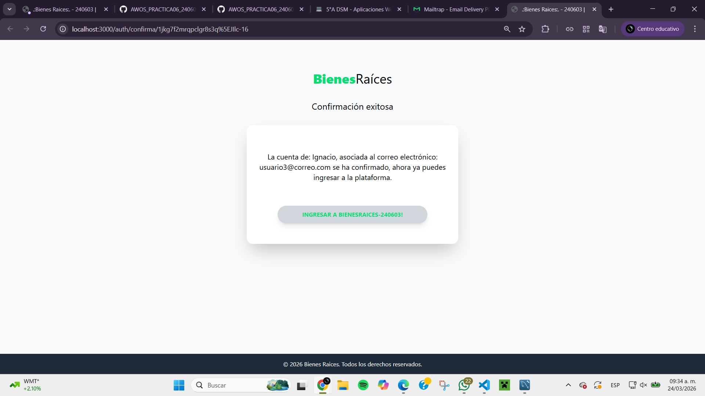
*Registro de un nuevo usuario exitoso*
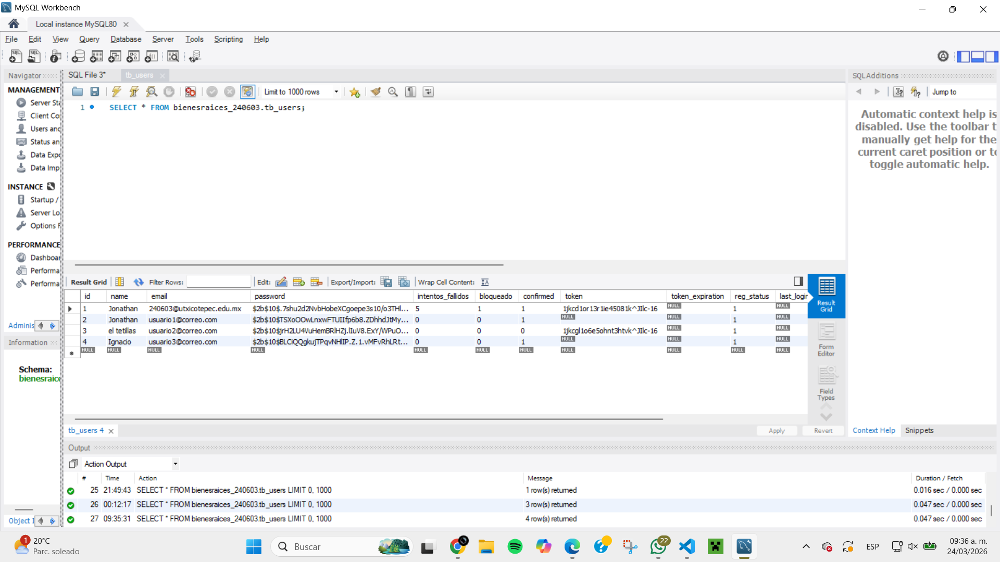
*Verificación del nuevo usuario en la base de datos con contraseña hasheada*
---
# Test 3: Registro Fallido (Formulario mal llenado)
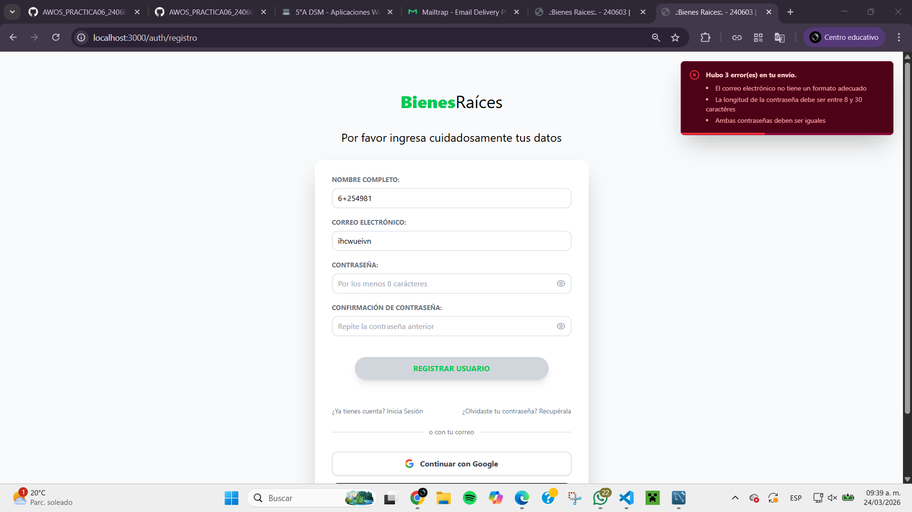
*Registro fallido por errores de formulario (campos vacíos, formato de email incorrecto, contraseña débil)*

---

# Test 4: Registro Fallido por correo duplicado
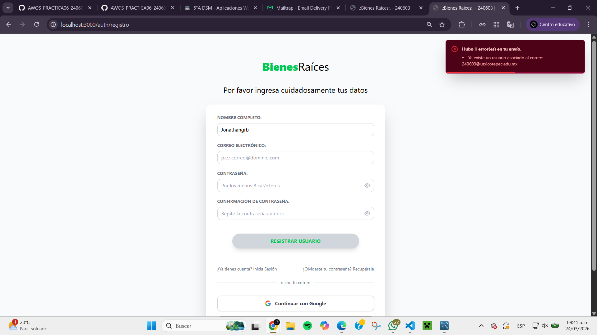
*Registro fallido por correo electrónico ya registrado en la base de datos* 

---

# Test 5: Validación de Usuario por Email

*Usuario recibe correo de validación y al hacer clic en el enlace, su cuenta se valida exitosamente*

*Registro de un nuevo usuario exitoso*

---
# Test 6: Actualización exitosa de contraseña de un usuario validado
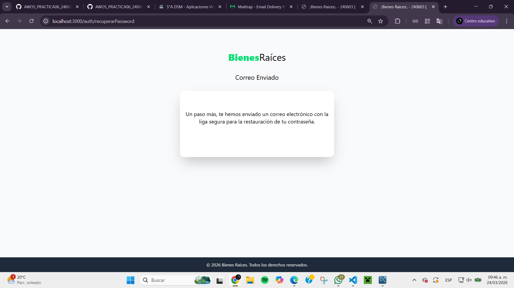
*Usuario recibe correo con enlace para actualizar contraseña*
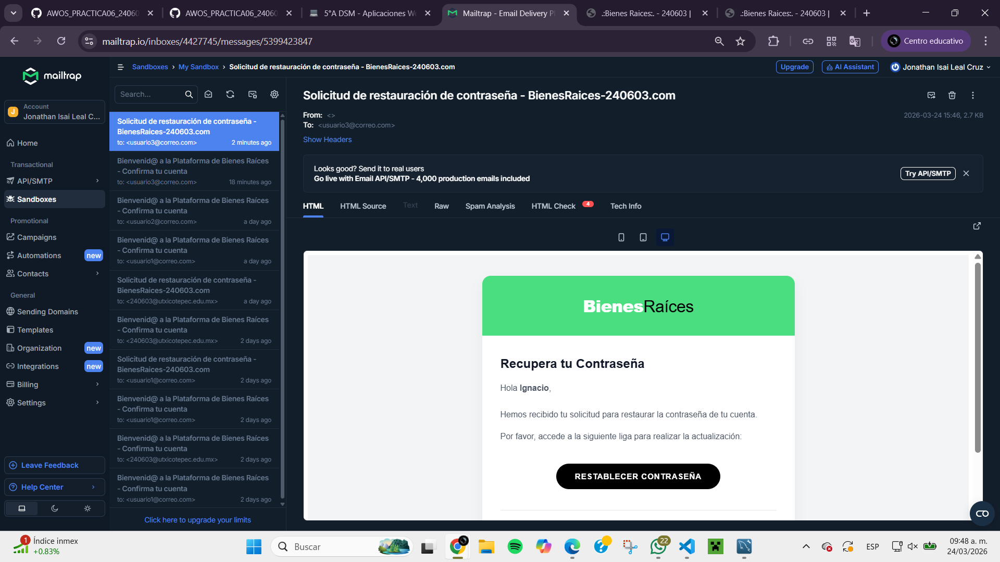
*Usuario actualiza su contraseña exitosamente y puede iniciar sesión con la nueva contraseña*

---
# Test 7: Actualización fallida de contraseña de un usuario no validado
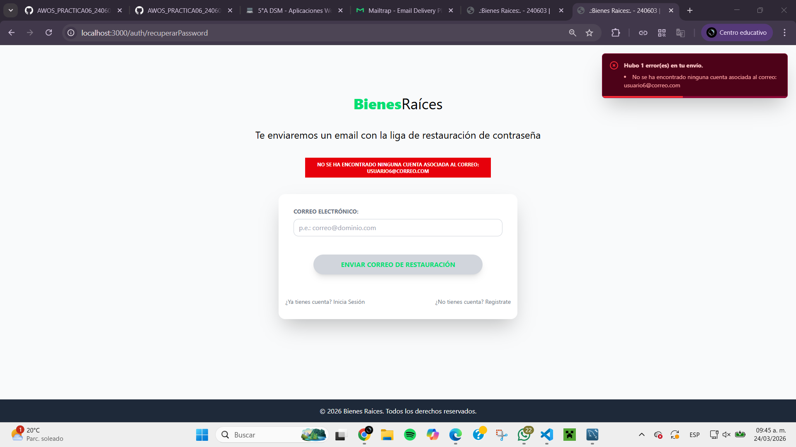
*Usuario no validado intenta actualizar su contraseña pero recibe un mensaje de error indicando que su cuenta no está validada* 

---
# Test 8: Actualización fallida (errores de formulario y token inválido)
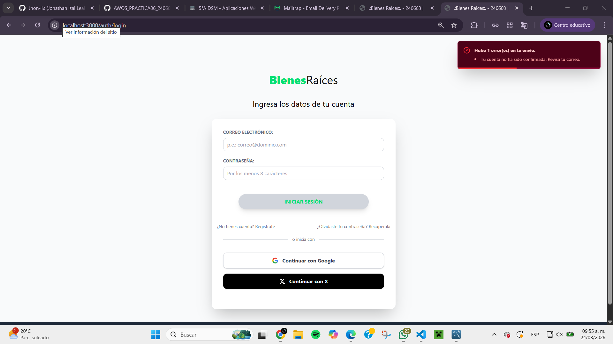
*Usuario intenta actualizar su contraseña pero comete errores en el formulario (campos vacíos, contraseña débil) o el token de actualización es inválido, recibiendo mensajes de error correspondientes*

---
# Test 9: Logeo Exitoso y redirección a Mis Propiedades
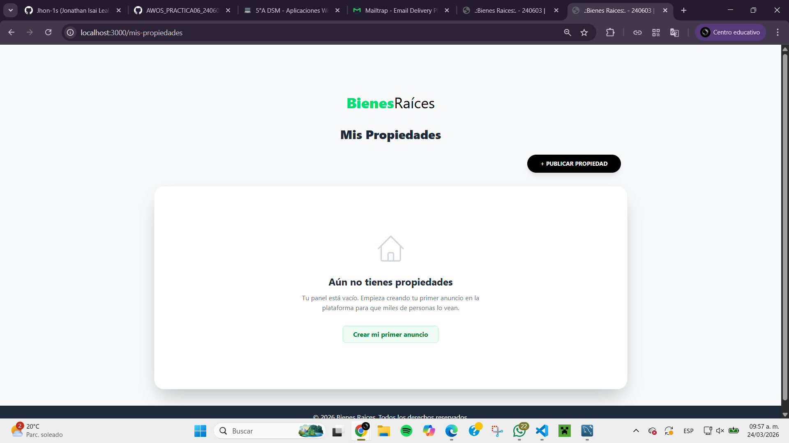
*Usuario inicia sesión exitosamente con su correo y contraseña, y es redirigido a la página de Mis Propiedades*

---
# Test 10: Bloqueo de cuenta por exceso de intentos fallidos (5 intentos)

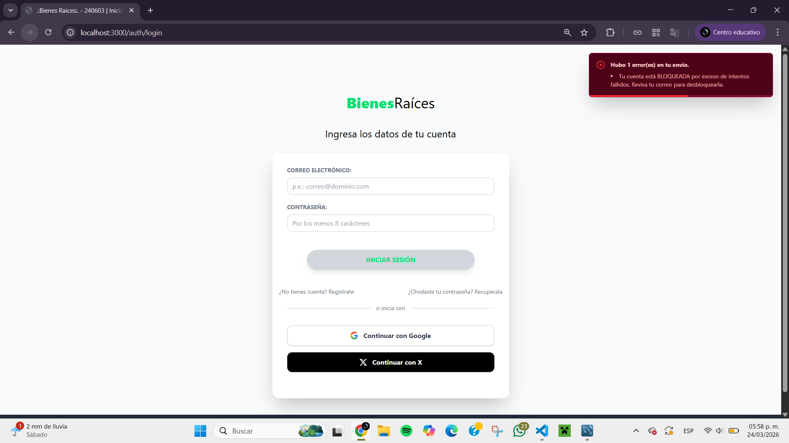
*Usuario intenta iniciar sesión con credenciales incorrectas repetidamente, y después de 5 intentos fallidos, su cuenta es bloqueada temporalmente, recibiendo un mensaje de error indicando el bloqueo*

## Creador por: 
Jonathan Isai Leal Cruz - 240603